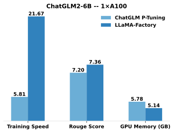

[](https://github.com/hiyouga/LLaMA-Factory/stargazers)
[](LICENSE)
[](https://github.com/hiyouga/LLaMA-Factory/commits/main)
[](https://pypi.org/project/llmtuner/)
[](https://pypi.org/project/llmtuner/)
[](#使用了-llama-factory-的项目)
[](https://github.com/hiyouga/LLaMA-Factory/pulls)
[](https://discord.gg/rKfvV9r9FK)
[](https://twitter.com/llamafactory_ai)
[](https://huggingface.co/spaces/hiyouga/LLaMA-Board)
[](https://modelscope.cn/studios/hiyouga/LLaMA-Board)
[](https://colab.research.google.com/drive/1d5KQtbemerlSDSxZIfAaWXhKr30QypiK?usp=sharing)

👋 加入我们的[微信群](assets/wechat.jpg)。

\[ [English](README.md) | 中文 \]

**微调大模型可以像这样轻松…**

https://github.com/hiyouga/LLaMA-Factory/assets/16256802/ec36a9dd-37f4-4f72-81bd-d76c6d0a6594

选择你的打开方式：

- **Colab**：https://colab.research.google.com/drive/1d5KQtbemerlSDSxZIfAaWXhKr30QypiK?usp=sharing
- **本地机器**：请见[如何使用](#如何使用)

## 目录

- [目录](#目录)
- [项目特色](#项目特色)
- [性能指标](#性能指标)
- [更新日志](#更新日志)
- [模型](#模型)
- [训练方法](#训练方法)
- [数据集](#数据集)
- [软硬件依赖](#软硬件依赖)
  - [硬件依赖](#硬件依赖)
- [如何使用](#如何使用)
  - [数据准备](#数据准备)
  - [安装依赖](#安装依赖)
  - [利用 LLaMA Board 可视化界面训练](#利用-llama-board-可视化界面训练)
    - [使用本地环境](#使用本地环境)
    - [使用 Docker](#使用-docker)
    - [使用 Docker Compose](#使用-docker-compose)
  - [利用命令行接口训练](#利用命令行接口训练)
  - [利用 vLLM 部署 OpenAI API](#利用-vllm-部署-openai-api)
  - [从魔搭社区下载](#从魔搭社区下载)
- [使用了 LLaMA Factory 的项目](#使用了-llama-factory-的项目)
- [协议](#协议)
- [引用](#引用)
- [致谢](#致谢)
- [Star History](#star-history)

## 项目特色

- **多种模型**：LLaMA、Mistral、Mixtral-MoE、Qwen、Yi、Gemma、Baichuan、ChatGLM、Phi 等等。
- **集成方法**：（增量）预训练、指令监督微调、奖励模型训练、PPO 训练、DPO 训练和 ORPO 训练。
- **多种精度**：32 比特全参数微调、16 比特冻结微调、16 比特 LoRA 微调和基于 AQLM/AWQ/GPTQ/LLM.int8 的 2/4/8 比特 QLoRA 微调。
- **先进算法**：GaLore、BAdam、DoRA、LongLoRA、LLaMA Pro、Mixture-of-Depths、LoRA+、LoftQ 和 Agent 微调。
- **实用技巧**：FlashAttention-2、Unsloth、RoPE scaling、NEFTune 和 rsLoRA。
- **实验监控**：LlamaBoard、TensorBoard、Wandb、MLflow 等等。
- **极速推理**：基于 vLLM 的 OpenAI 风格 API、浏览器界面和命令行接口。

## 性能指标

与 ChatGLM 官方的 [P-Tuning](https://github.com/THUDM/ChatGLM2-6B/tree/main/ptuning) 微调相比，LLaMA Factory 的 LoRA 微调提供了 **3.7 倍**的加速比，同时在广告文案生成任务上取得了更高的 Rouge 分数。结合 4 比特量化技术，LLaMA Factory 的 QLoRA 微调进一步降低了 GPU 显存消耗。



<details><summary>变量定义</summary>

- **Training Speed**: 训练阶段每秒处理的样本数量。（批处理大小=4，截断长度=1024）
- **Rouge Score**: [广告文案生成](https://aclanthology.org/D19-1321.pdf)任务验证集上的 Rouge-2 分数。（批处理大小=4，截断长度=1024）
- **GPU Memory**: 4 比特量化训练的 GPU 显存峰值。（批处理大小=1，截断长度=1024）
- 我们在 ChatGLM 的 P-Tuning 中采用 `pre_seq_len=128`，在 LLaMA Factory 的 LoRA 微调中采用 `lora_rank=32`。

</details>

## 更新日志

[24/04/22] 我们提供了在免费 T4 GPU 上微调 Llama-3 模型的 **[Colab 笔记本](https://colab.research.google.com/drive/1d5KQtbemerlSDSxZIfAaWXhKr30QypiK?usp=sharing)**。Hugging Face 社区公开了两个利用 LLaMA Factory 微调的 Llama-3 模型，详情请见 [Llama3-8B-Chinese-Chat](https://huggingface.co/shenzhi-wang/Llama3-8B-Chinese-Chat) 和 [Llama3-Chinese](https://huggingface.co/zhichen/Llama3-Chinese)。

[24/04/21] 我们基于 [AstraMindAI 的仓库](https://github.com/astramind-ai/Mixture-of-depths)支持了 **[混合深度训练](https://arxiv.org/abs/2404.02258)**。详细用法请参照 `examples/extras/mod`。

[24/04/19] 我们支持了 **Meta Llama 3** 系列模型。

[24/04/16] 我们支持了 **[BAdam](https://arxiv.org/abs/2404.02827)**。详细用法请参照 `examples/extras/badam`。

[24/04/16] 我们支持了 **[unsloth](https://github.com/unslothai/unsloth)** 的长序列训练（24GB 可训练 Llama-2-7B-56k）。该方法相比 FlashAttention-2 提供了 **117%** 的训练速度和 **50%** 的显存节约。更多数据请见[此页面](https://github.com/hiyouga/LLaMA-Factory/wiki/Performance-comparison)。

<details><summary>展开日志</summary>

[24/03/31] 我们支持了 **[ORPO](https://arxiv.org/abs/2403.07691)**。详细用法请参照 `examples/lora_single_gpu`。

[24/03/21] 我们的论文 "[LlamaFactory: Unified Efficient Fine-Tuning of 100+ Language Models](https://arxiv.org/abs/2403.13372)" 可在 arXiv 上查看！

[24/03/20] 我们支持了能在 2x24GB GPU 上微调 70B 模型的 **FSDP+QLoRA**。详细用法请参照 `examples/extras/fsdp_qlora`。

[24/03/13] 我们支持了 **[LoRA+](https://arxiv.org/abs/2402.12354)**。详细用法请参照 `examples/extras/loraplus`。

[24/03/07] 我们支持了梯度低秩投影（**[GaLore](https://arxiv.org/abs/2403.03507)**）算法。详细用法请参照 `examples/extras/galore`。

[24/03/07] 我们集成了 **[vLLM](https://github.com/vllm-project/vllm)** 以实现极速并发推理。请使用 `--infer_backend vllm` 来获得 **270%** 的推理速度。（尚不支持 LoRA，请先合并权重。）

[24/02/28] 我们支持了 **[DoRA](https://arxiv.org/abs/2402.09353)** 微调。请使用 `--use_dora` 参数进行 DoRA 微调。

[24/02/15] 我们支持了 [LLaMA Pro](https://github.com/TencentARC/LLaMA-Pro) 提出的**块扩展**方法。详细用法请参照 `examples/extras/llama_pro`。

[24/02/05] Qwen1.5（Qwen2 测试版）系列模型已在 LLaMA-Factory 中实现微调支持。详情请查阅该[博客页面](https://qwenlm.github.io/zh/blog/qwen1.5/)。

[24/01/18] 我们针对绝大多数模型实现了 **Agent 微调**，微调时指定 `--dataset glaive_toolcall` 即可使模型获得工具调用能力。

[23/12/23] 我们针对 LLaMA, Mistral 和 Yi 模型支持了 **[unsloth](https://github.com/unslothai/unsloth)** 的 LoRA 训练加速。请使用 `--use_unsloth` 参数启用 unsloth 优化。该方法可提供 **170%** 的训练速度，详情请查阅[此页面](https://github.com/hiyouga/LLaMA-Factory/wiki/Performance-comparison)。

[23/12/12] 我们支持了微调最新的混合专家模型 **[Mixtral 8x7B](https://huggingface.co/mistralai/Mixtral-8x7B-v0.1)**。硬件需求请查阅[此处](#硬件依赖)。

[23/12/01] 我们支持了从 **[魔搭社区](https://modelscope.cn/models)** 下载预训练模型和数据集。详细用法请参照 [此教程](#使用魔搭社区可跳过)。

[23/10/21] 我们支持了 **[NEFTune](https://arxiv.org/abs/2310.05914)** 训练技巧。请使用 `--neftune_noise_alpha` 参数启用 NEFTune，例如 `--neftune_noise_alpha 5`。

[23/09/27] 我们针对 LLaMA 模型支持了 [LongLoRA](https://github.com/dvlab-research/LongLoRA) 提出的 **$S^2$-Attn**。请使用 `--shift_attn` 参数以启用该功能。

[23/09/23] 我们在项目中集成了 MMLU、C-Eval 和 CMMLU 评估集。使用方法请参阅[此示例](#模型评估)。

[23/09/10] 我们支持了 **[FlashAttention-2](https://github.com/Dao-AILab/flash-attention)**。如果您使用的是 RTX4090、A100 或 H100 GPU，请使用 `--flash_attn` 参数以启用 FlashAttention-2。

[23/08/12] 我们支持了 **RoPE 插值**来扩展 LLaMA 模型的上下文长度。请使用 `--rope_scaling linear` 参数训练模型或使用 `--rope_scaling dynamic` 参数评估模型。

[23/08/11] 我们支持了指令模型的 **[DPO 训练](https://arxiv.org/abs/2305.18290)**。使用方法请参阅[此示例](#dpo-训练)。

[23/07/31] 我们支持了**数据流式加载**。请使用 `--streaming` 和 `--max_steps 10000` 参数来流式加载数据集。

[23/07/29] 我们在 Hugging Face 发布了两个 13B 指令微调模型。详细内容请查阅我们的 Hugging Face 项目（[LLaMA-2](https://huggingface.co/hiyouga/Llama-2-Chinese-13b-chat) / [Baichuan](https://huggingface.co/hiyouga/Baichuan-13B-sft)）。

[23/07/18] 我们开发了支持训练和测试的**浏览器一体化界面**。请使用 `train_web.py` 在您的浏览器中微调模型。感谢 [@KanadeSiina](https://github.com/KanadeSiina) 和 [@codemayq](https://github.com/codemayq) 在该功能开发中付出的努力。

[23/07/09] 我们开源了 **[FastEdit](https://github.com/hiyouga/FastEdit)** ⚡🩹，一个简单易用的、能迅速编辑大模型事实记忆的工具包。如果您感兴趣请关注我们的 [FastEdit](https://github.com/hiyouga/FastEdit) 项目。

[23/06/29] 我们提供了一个**可复现的**指令模型微调示例，详细内容请查阅 [Baichuan-7B-sft](https://huggingface.co/hiyouga/Baichuan-7B-sft)。

[23/06/22] 我们对齐了[示例 API](src/api_demo.py) 与 [OpenAI API](https://platform.openai.com/docs/api-reference/chat) 的格式，您可以将微调模型接入**任意基于 ChatGPT 的应用**中。

[23/06/03] 我们实现了 4 比特的 LoRA 训练（也称 **[QLoRA](https://github.com/artidoro/qlora)**）。请使用 `--quantization_bit 4` 参数进行 4 比特量化微调。

</details>

## 模型

| 模型名                                               | 模型大小                    | 默认模块        | Template  |
| ---------------------------------------------------- | --------------------------- | --------------- | --------- |
| [Baichuan2](https://huggingface.co/baichuan-inc)     | 7B/13B                      | W_pack          | baichuan2 |
| [BLOOM](https://huggingface.co/bigscience)           | 560M/1.1B/1.7B/3B/7.1B/176B | query_key_value | -         |
| [BLOOMZ](https://huggingface.co/bigscience)          | 560M/1.1B/1.7B/3B/7.1B/176B | query_key_value | -         |
| [ChatGLM3](https://huggingface.co/THUDM)             | 6B                          | query_key_value | chatglm3  |
| [Command-R](https://huggingface.co/CohereForAI)      | 35B/104B                    | q_proj,v_proj   | cohere    |
| [DeepSeek (MoE)](https://huggingface.co/deepseek-ai) | 7B/16B/67B                  | q_proj,v_proj   | deepseek  |
| [Falcon](https://huggingface.co/tiiuae)              | 7B/40B/180B                 | query_key_value | falcon    |
| [Gemma/CodeGemma](https://huggingface.co/google)     | 2B/7B                       | q_proj,v_proj   | gemma     |
| [InternLM2](https://huggingface.co/internlm)         | 7B/20B                      | wqkv            | intern2   |
| [LLaMA](https://github.com/facebookresearch/llama)   | 7B/13B/33B/65B              | q_proj,v_proj   | -         |
| [LLaMA-2](https://huggingface.co/meta-llama)         | 7B/13B/70B                  | q_proj,v_proj   | llama2    |
| [LLaMA-3](https://huggingface.co/meta-llama)         | 8B/70B                      | q_proj,v_proj   | llama3    |
| [Mistral/Mixtral](https://huggingface.co/mistralai)  | 7B/8x7B/8x22B               | q_proj,v_proj   | mistral   |
| [OLMo](https://huggingface.co/allenai)               | 1B/7B                       | att_proj        | olmo      |
| [Phi-1.5/2](https://huggingface.co/microsoft)        | 1.3B/2.7B                   | q_proj,v_proj   | -         |
| [Qwen](https://huggingface.co/Qwen)                  | 1.8B/7B/14B/72B             | c_attn          | qwen      |
| [Qwen1.5 (Code/MoE)](https://huggingface.co/Qwen)    | 0.5B/1.8B/4B/7B/14B/32B/72B | q_proj,v_proj   | qwen      |
| [StarCoder2](https://huggingface.co/bigcode)         | 3B/7B/15B                   | q_proj,v_proj   | -         |
| [XVERSE](https://huggingface.co/xverse)              | 7B/13B/65B                  | q_proj,v_proj   | xverse    |
| [Yi](https://huggingface.co/01-ai)                   | 6B/9B/34B                   | q_proj,v_proj   | yi        |
| [Yuan](https://huggingface.co/IEITYuan)              | 2B/51B/102B                 | q_proj,v_proj   | yuan      |

> [!NOTE]
> **默认模块**应作为 `--lora_target` 参数的默认值，可使用 `--lora_target all` 参数指定全部模块以得到更好的效果。
>
> 对于所有“基座”（Base）模型，`--template` 参数可以是 `default`, `alpaca`, `vicuna` 等任意值。但“对话”（Instruct/Chat）模型请务必使用**对应的模板**。
>
> 请务必在训练和推理时使用**完全一致**的模板。

项目所支持模型的完整列表请参阅 [constants.py](src/llmtuner/extras/constants.py)。

您也可以在 [template.py](src/llmtuner/data/template.py) 中添加自己的对话模板。

## 训练方法

| 方法         | 全参数训练         | 部分参数训练       | LoRA               | QLoRA              |
| ------------ | ------------------ | ------------------ | ------------------ | ------------------ |
| 预训练       | :white_check_mark: | :white_check_mark: | :white_check_mark: | :white_check_mark: |
| 指令监督微调 | :white_check_mark: | :white_check_mark: | :white_check_mark: | :white_check_mark: |
| 奖励模型训练 | :white_check_mark: | :white_check_mark: | :white_check_mark: | :white_check_mark: |
| PPO 训练     | :white_check_mark: | :white_check_mark: | :white_check_mark: | :white_check_mark: |
| DPO 训练     | :white_check_mark: | :white_check_mark: | :white_check_mark: | :white_check_mark: |
| ORPO 训练    | :white_check_mark: | :white_check_mark: | :white_check_mark: | :white_check_mark: |

> [!NOTE]PPO（Proximal Policy Optimization）、DPO（Direct Preference Optimization）和ORPO（Odds Ratio Preference Optimization）是三种不同的训练方法，以下是这三种训练方式的区别:
> 1. **PPO 训练**:
>    - PPO 是一种强化学习算法，它通过策略梯度方法来优化代理（agent）的行为策略，以最大化期望回报。
>    - PPO 的关键特性是它使用裁剪的概率比率来限制策略更新的幅度，这有助于维持训练过程的稳定性。
>    - PPO 算法包括收集数据、计算优势估计、优化目标函数、更新策略等步骤，通常用于与环境交互的任务中。
> 2. **DPO 训练**:
>    - DPO 是一种直接偏好优化算法，它关注于优化模型输出以符合人类的偏好。
>    - DPO 训练涉及到比较不同的响应（例如，好的响应和差的响应），并通过这种方式来调整模型的输出，使其更倾向于生成好的响应。
>    - DPO 通常需要较少的计算资源和时间，因为它直接在偏好数据上进行训练，而不需要额外的SFT（Supervised Fine-Tuning）阶段。
> 3. **ORPO 训练**:
>    - ORPO 是一种无参考模型的单体偏好优化方法，它结SFT和偏好对齐到一个新的目标（损失函数）中，从而免去了耗时的SFT阶段。
>    - ORPO 通过对非偏好的生成内容施与小的惩罚来实现偏好对齐，它使用赔率比（Odds Ratio）来平衡偏好和非偏好的响应。
>    - ORPO 被认为在资源效率和性能上都优于传统的SFT和DPO方法，因为它避免了额外的SFT步骤和参考模型的需求。
> 
> **区别**:
> - **算法目标**: PPO 主要用于强化学习中的策略优化，而 DPO 和 ORPO 专注于优化语言模型的输出以符合人类的偏好。
> - **实现复杂度**: PPO 通常比 DPO 和 ORPO 更复杂，因为它涉及到更多的强化学习概念和步骤。
> - **资源消耗**: DPO 和 ORPO 旨在减少训练大型语言模型所需的资源，特别是 ORPO，它通过减少训练阶段来提高资源效率。
> - **训练过程**: PPO 通过与环境的交互来改进策略，而 DPO 和 ORPO 则通过比较不同响应的偏好来调整模型输出。

> [!NOTE]详细解释:
> 1. **PPO (Proximal Policy Optimization)**:
>    - PPO是一种策略梯度方法,广泛应用于强化学习领域。
>    - 它通过限制新策略与旧策略的差异来实现稳定训练,提高样本利用效率。
>    - 在NLP中,PPO被用于预训练语言模型,以最大化模型在各种文本数据上的似然概率。
>    - PPO的优点是训练较为稳定,但收敛速度较慢。
> 2. **DPO (Differentiable Policy Optimization)**: 
>    - DPO融合了策略梯度和进化策略的优点。
>    - 它使用连续松弛(continuous relaxation)将离散采样视为可微分函数近似。
>    - 这种近似使DPO能直接优化离散序列概率,避免了传统REINFORCE算法中的高方差问题。
>    - 相比PPO,DPO通常收敛更快、样本利用率更高。
> 3. **ORPO (Ordered Reparam Optimization)**:
>    - ORPO是DPO的一种变体,专门针对序列生成任务而设计。
>    - 它通过置换不变性重新参数化(permutation-invariant reparameterization)解决了DPO在长序列中的失效问题。
>    - ORPO保留了DPO优点的同时,可以更高效地处理长文本序列。
>    - 在某些任务上,ORPO展现出比DPO和PPO更快的收敛速度。
> 
> 总的来说,PPO是一种传统而稳定的策略优化方法,DPO则通过连续松弛技巧提高了效率,ORPO在此基础上进一步提升了长序列建模能力。它们各有优缺点,PPO更保守、DPO/ORPO则更前沿创新。具体选择哪种方法需要权衡模型大小、任务类型、硬件资源和训练预算等多方面因素。

## 数据集

<details><summary>预训练数据集</summary>

- [Wiki Demo (en)](data/wiki_demo.txt)
- [RefinedWeb (en)](https://huggingface.co/datasets/tiiuae/falcon-refinedweb)
- [RedPajama V2 (en)](https://huggingface.co/datasets/togethercomputer/RedPajama-Data-V2)
- [Wikipedia (en)](https://huggingface.co/datasets/olm/olm-wikipedia-20221220)
- [Wikipedia (zh)](https://huggingface.co/datasets/pleisto/wikipedia-cn-20230720-filtered)
- [Pile (en)](https://huggingface.co/datasets/EleutherAI/pile)
- [SkyPile (zh)](https://huggingface.co/datasets/Skywork/SkyPile-150B)
- [The Stack (en)](https://huggingface.co/datasets/bigcode/the-stack)
- [StarCoder (en)](https://huggingface.co/datasets/bigcode/starcoderdata)

</details>

<details><summary>指令微调数据集</summary>

- [Stanford Alpaca (en)](https://github.com/tatsu-lab/stanford_alpaca)
- [Stanford Alpaca (zh)](https://github.com/ymcui/Chinese-LLaMA-Alpaca)
- [Alpaca GPT4 (en&zh)](https://github.com/Instruction-Tuning-with-GPT-4/GPT-4-LLM)
- [Self Cognition (zh)](data/self_cognition.json)
- [Open Assistant (multilingual)](https://huggingface.co/datasets/OpenAssistant/oasst1)
- [ShareGPT (zh)](https://huggingface.co/datasets/QingyiSi/Alpaca-CoT/tree/main/Chinese-instruction-collection)
- [Guanaco Dataset (multilingual)](https://huggingface.co/datasets/JosephusCheung/GuanacoDataset)
- [BELLE 2M (zh)](https://huggingface.co/datasets/BelleGroup/train_2M_CN)
- [BELLE 1M (zh)](https://huggingface.co/datasets/BelleGroup/train_1M_CN)
- [BELLE 0.5M (zh)](https://huggingface.co/datasets/BelleGroup/train_0.5M_CN)
- [BELLE Dialogue 0.4M (zh)](https://huggingface.co/datasets/BelleGroup/generated_chat_0.4M)
- [BELLE School Math 0.25M (zh)](https://huggingface.co/datasets/BelleGroup/school_math_0.25M)
- [BELLE Multiturn Chat 0.8M (zh)](https://huggingface.co/datasets/BelleGroup/multiturn_chat_0.8M)
- [UltraChat (en)](https://github.com/thunlp/UltraChat)
- [LIMA (en)](https://huggingface.co/datasets/GAIR/lima)
- [OpenPlatypus (en)](https://huggingface.co/datasets/garage-bAInd/Open-Platypus)
- [CodeAlpaca 20k (en)](https://huggingface.co/datasets/sahil2801/CodeAlpaca-20k)
- [Alpaca CoT (multilingual)](https://huggingface.co/datasets/QingyiSi/Alpaca-CoT)
- [OpenOrca (en)](https://huggingface.co/datasets/Open-Orca/OpenOrca)
- [SlimOrca (en)](https://huggingface.co/datasets/Open-Orca/SlimOrca)
- [MathInstruct (en)](https://huggingface.co/datasets/TIGER-Lab/MathInstruct)
- [Firefly 1.1M (zh)](https://huggingface.co/datasets/YeungNLP/firefly-train-1.1M)
- [Wiki QA (en)](https://huggingface.co/datasets/wiki_qa)
- [Web QA (zh)](https://huggingface.co/datasets/suolyer/webqa)
- [WebNovel (zh)](https://huggingface.co/datasets/zxbsmk/webnovel_cn)
- [Nectar (en)](https://huggingface.co/datasets/berkeley-nest/Nectar)
- [deepctrl (en&zh)](https://www.modelscope.cn/datasets/deepctrl/deepctrl-sft-data)
- [Ad Gen (zh)](https://huggingface.co/datasets/HasturOfficial/adgen)
- [ShareGPT Hyperfiltered (en)](https://huggingface.co/datasets/totally-not-an-llm/sharegpt-hyperfiltered-3k)
- [ShareGPT4 (en&zh)](https://huggingface.co/datasets/shibing624/sharegpt_gpt4)
- [UltraChat 200k (en)](https://huggingface.co/datasets/HuggingFaceH4/ultrachat_200k)
- [AgentInstruct (en)](https://huggingface.co/datasets/THUDM/AgentInstruct)
- [LMSYS Chat 1M (en)](https://huggingface.co/datasets/lmsys/lmsys-chat-1m)
- [Evol Instruct V2 (en)](https://huggingface.co/datasets/WizardLM/WizardLM_evol_instruct_V2_196k)
- [Glaive Function Calling V2 (en)](https://huggingface.co/datasets/glaiveai/glaive-function-calling-v2)
- [Cosmopedia (en)](https://huggingface.co/datasets/HuggingFaceTB/cosmopedia)
- [Open Assistant (de)](https://huggingface.co/datasets/mayflowergmbh/oasst_de)
- [Dolly 15k (de)](https://huggingface.co/datasets/mayflowergmbh/dolly-15k_de)
- [Alpaca GPT4 (de)](https://huggingface.co/datasets/mayflowergmbh/alpaca-gpt4_de)
- [OpenSchnabeltier (de)](https://huggingface.co/datasets/mayflowergmbh/openschnabeltier_de)
- [Evol Instruct (de)](https://huggingface.co/datasets/mayflowergmbh/evol-instruct_de)
- [Dolphin (de)](https://huggingface.co/datasets/mayflowergmbh/dolphin_de)
- [Booksum (de)](https://huggingface.co/datasets/mayflowergmbh/booksum_de)
- [Airoboros (de)](https://huggingface.co/datasets/mayflowergmbh/airoboros-3.0_de)
- [Ultrachat (de)](https://huggingface.co/datasets/mayflowergmbh/ultra-chat_de)

</details>

<details><summary>偏好数据集</summary>

- [HH-RLHF (en)](https://huggingface.co/datasets/Anthropic/hh-rlhf)
- [Open Assistant (multilingual)](https://huggingface.co/datasets/OpenAssistant/oasst1)
- [GPT-4 Generated Data (en&zh)](https://github.com/Instruction-Tuning-with-GPT-4/GPT-4-LLM)
- [Orca DPO (en)](https://huggingface.co/datasets/Intel/orca_dpo_pairs)
- [Nectar (en)](https://huggingface.co/datasets/berkeley-nest/Nectar)
- [DPO mix (en&zh)](https://huggingface.co/datasets/hiyouga/DPO-En-Zh-20k)
- [Orca DPO (de)](https://huggingface.co/datasets/mayflowergmbh/intel_orca_dpo_pairs_de)

</details>

部分数据集的使用需要确认，我们推荐使用下述命令登录您的 Hugging Face 账户。

```bash
pip install --upgrade huggingface_hub
huggingface-cli login
```

## 软硬件依赖

| 必需项       | 至少   | 推荐   |
| ------------ | ------ | ------ |
| python       | 3.8    | 3.10   |
| torch        | 1.13.1 | 2.2.0  |
| transformers | 4.37.2 | 4.39.3 |
| datasets     | 2.14.3 | 2.18.0 |
| accelerate   | 0.27.2 | 0.28.0 |
| peft         | 0.9.0  | 0.10.0 |
| trl          | 0.8.1  | 0.8.1  |

| 可选项       | 至少   | 推荐   |
| ------------ | ------ | ------ |
| CUDA         | 11.6   | 12.2   |
| deepspeed    | 0.10.0 | 0.14.0 |
| bitsandbytes | 0.39.0 | 0.43.0 |
| flash-attn   | 2.3.0  | 2.5.6  |

### 硬件依赖

\* *估算值*

| 方法              | 精度 | 7B    | 13B   | 30B   | 70B    | 8x7B  | 8x22B  |
| ----------------- | ---- | ----- | ----- | ----- | ------ | ----- | ------ |
| Full              | AMP  | 120GB | 240GB | 600GB | 1200GB | 900GB | 2400GB |
| Full              | 16   | 60GB  | 120GB | 300GB | 600GB  | 400GB | 1200GB |
| Freeze            | 16   | 20GB  | 40GB  | 80GB  | 200GB  | 160GB | 400GB  |
| LoRA/GaLore/BAdam | 16   | 16GB  | 32GB  | 64GB  | 160GB  | 120GB | 320GB  |
| QLoRA             | 8    | 10GB  | 20GB  | 40GB  | 80GB   | 60GB  | 160GB  |
| QLoRA             | 4    | 6GB   | 12GB  | 24GB  | 48GB   | 30GB  | 96GB   |
| QLoRA             | 2    | 4GB   | 8GB   | 16GB  | 24GB   | 18GB  | 48GB   |

> [!NOTE] LoRA、GaLore、BAdam 和 QLoRA 这四种技术在大型模型微调中的应用和区别：
> 1. **LoRA (Low-Rank Adaptation)**:
>    - LoRA 是一种参数高效的微调方法，它通过在Transformer模型的自注意力机制中引入低秩矩阵来适配下游任务，而不需要改变模型的原始结构。
>    - 这种方法通过减少可训练参数的数量来降低模型的内存占用和计算成本，同时保持了模型的性能。
>    - LoRA 通常只微调模型的特定部分，如注意力机制的查询（Q）、键（K）和值（V）向量，而保持其他部分的权重不变。
> 2. **QLoRA**:
>    - QLoRA 是 LoRA 的一个改进版本，它结合了低秩适应和量化技术，以进一步减少模型的内存占用和计算需求。
>    - 它通过对模型权重进行4位量化，并应用低秩适配器来进行微调，这使得在单个GPU上微调非常大的模型成为可能。
>    - QLoRA 引入了新的数据类型（如4位NormalFloat）和优化技术（如双量化和分页优化器），这些技术共同作用以减少内存占用，同时尽量保持模型性能。
> 3. **GaLore (Generalized Low-Rank Adaptation)**:
>    - GaLore 是 LoRA 的一种泛化形式，它提供了更灵活的低秩适应方式，允许模型在更多的参数上进行微调。
>    - 与 LoRA 相比，GaLore 可能在微调时有更多的参数可以更新，这可以提高模型对特定任务的适应性，但也可能需要更多的计算资源。
>    - GaLore 的设计目的是提高模型微调的性能，尤其是在数据集较小或者模型规模较大的情况下。
> 4. **BAdam**:
>    - BAdam 是一种优化算法，它是 Adam 优化器的一个变种，专门用于处理大规模的参数更新。
>    - 它在大型模型的微调中非常有用，因为它提供了更好的稳定性和更快的收敛速度，尤其是在使用大批量大小进行训练时。
>    - BAdam 通常与微调技术（如 LoRA 或 QLoRA）结合使用，以优化微调过程中的参数更新步骤。  
> 
> **总结区别**:
> - LoRA 和 QLoRA 主要关注于通过结构化的方法减少模型的参数数量和内存占用，使大型模型的微调更加高效。
> - GaLore 作为 LoRA 的扩展，提供了更广泛的参数适应性，但可能会需要更多的计算资源。
> - BAdam 是一种优化算法，它可以与上述任何微调技术结合使用，以改善训练过程的效率和稳定性。
> - 在选择微调技术时，需要考虑到任务的具体需求、可用的计算资源以及期望的性能提升。

> [!NOTE] 详细解释:
> 1. **LoRA (Low-Rank Adaptation)**:
>    - 它通过将可训练的低秩矩阵 A、B 分别相乘于预训练模型的关键层(通常是多头注意力层)的权重 W 和偏置 b,从而实现微调。
>    - 公式为: W' = W + BA, b' = b + Bb  
>    - 由于 A、B 是低秩矩阵,所以可训练参数数量大大降低,典型地只有预训练模型的 0.1%~1%。
>    - 训练时只更新 A、B,预训练权重 W、b 保持不变,因此可以高效共享预训练模型参数。
>    - 推理时将 W'、b' 用于计算,不需要单独存储 A、B,因此无额外存储开销。
> 2. **QLoRA (Quant-LoRA)**:
>    - QLoRA在LoRA基础上,利用量化技术进一步压缩 A、B 矩阵。
>    - 它使用较少位宽(如4位或2位)表示 A、B 中的元素,从而大幅降低存储需求。
>    - 同时使用特殊的量化感知训练方法,使量化误差最小化。
>    - 相比LoRA,QLoRA的存储开销可以降低4倍或8倍。
> 3. **GaLore (Generalized LoRA)**:
>    - GaLore推广了LoRA的思路,不仅可以微调多头注意力层,还能微调其他层如卷积层等。
>    - 它为每种层类型设计了不同的低秩矩阵分解方式,实现高效微调。
>    - 在计算机视觉等领域,GaLore可同时微调Transformer和CNN模型。
> 4. **BAdam (Bias-Corrected Adaptive Gradient Descent)**:  
>    - BAdam是一种优化算法,用于更高效地训练包括LoRA等微调方法在内的模型。
>    - 它修正了Adam优化器中梯度估计的偏差,提供更准确的梯度信息。
>    - 使用BAdam可加速收敛并提高微调模型的最终性能。  
> 
> **综上所述**:  
> LoRA主要降低微调所需计算资源,QLoRA进一步降低存储需求,GaLore推广了微调能力,BAdam则提升了优化效率。它们可组合使用以获得最佳效果。选择哪些技术的组合,需要权衡计算/存储资源限制、目标任务类型和性能要求。

## 如何使用

### 数据准备

关于数据集文件的格式，请参考 [data/README_zh.md](data/README_zh.md) 的内容。你可以使用 HuggingFace / ModelScope 上的数据集或加载本地数据集。

> [!NOTE]
> 使用自定义数据集时，请更新 `data/dataset_info.json` 文件。

### 安装依赖

```bash
git clone https://github.com/hiyouga/LLaMA-Factory.git
conda create -n llama_factory python=3.10
conda activate llama_factory
cd LLaMA-Factory
pip install -e .[metrics]
```

可选的额外依赖项：deepspeed、metrics、unsloth、galore、badam、vllm、bitsandbytes、gptq、awq、aqlm、qwen、modelscope、quality

<details><summary>Windows 用户指南</summary>

如果要在 Windows 平台上开启量化 LoRA（QLoRA），需要安装预编译的 `bitsandbytes` 库, 支持 CUDA 11.1 到 12.2, 请根据您的 CUDA 版本情况选择适合的[发布版本](https://github.com/jllllll/bitsandbytes-windows-webui/releases/tag/wheels)。

```bash
pip install https://github.com/jllllll/bitsandbytes-windows-webui/releases/download/wheels/bitsandbytes-0.41.2.post2-py3-none-win_amd64.whl
```

如果要在 Windows 平台上开启 FlashAttention-2，需要安装预编译的 `flash-attn` 库，支持 CUDA 12.1 到 12.2，请根据需求到 [flash-attention](https://github.com/bdashore3/flash-attention/releases) 下载对应版本安装。

</details>

### 利用 LLaMA Board 可视化界面训练

> [!IMPORTANT]
> LLaMA Board 可视化界面目前仅支持单 GPU 训练，请使用[命令行接口](#命令行接口)来进行多 GPU 分布式训练。

#### 使用本地环境

```bash
export CUDA_VISIBLE_DEVICES=0 # Windows 使用 `set CUDA_VISIBLE_DEVICES=0`
export GRADIO_SERVER_PORT=7860 # Windows 使用 `set GRADIO_SERVER_PORT=7860`
python src/train_web.py # 或 python -m llmtuner.webui.interface
```

<details><summary>阿里云用户指南</summary>

如果您在阿里云上使用 LLaMA Board 时遇到显示问题，请尝试在启动前使用以下命令设置环境变量：

```bash
export GRADIO_ROOT_PATH=/${JUPYTER_NAME}/proxy/7860/
```

</details>

#### 使用 Docker

```bash
docker build -f ./Dockerfile -t llama-factory:latest .
docker run --gpus=all \
    -v ./hf_cache:/root/.cache/huggingface/ \
    -v ./data:/app/data \
    -v ./output:/app/output \
    -e CUDA_VISIBLE_DEVICES=0 \
    -p 7860:7860 \
    --shm-size 16G \
    --name llama_factory \
    -d llama-factory:latest
```

#### 使用 Docker Compose

```bash
docker compose -f ./docker-compose.yml up -d
```

<details><summary>数据卷详情</summary>

- hf_cache：使用宿主机的 Hugging Face 缓存文件夹，允许更改为新的目录。
- data：宿主机中存放数据集的文件夹路径。
- output：将导出目录设置为该路径后，即可在宿主机中访问导出后的模型。

</details>

### 利用命令行接口训练

使用方法请参考 [examples/README_zh.md](examples/README_zh.md)。

您可以执行 `python src/train_bash.py -h` 来查看参数文档。

### 利用 vLLM 部署 OpenAI API

```bash
CUDA_VISIBLE_DEVICES=0,1 API_PORT=8000 python src/api_demo.py \
    --model_name_or_path meta-llama/Meta-Llama-3-8B-Instruct \
    --template llama3 \
    --infer_backend vllm \
    --vllm_enforce_eager
```

### 从魔搭社区下载

如果您在 Hugging Face 模型和数据集的下载中遇到了问题，可以通过下述方法使用魔搭社区。

```bash
export USE_MODELSCOPE_HUB=1 # Windows 使用 `set USE_MODELSCOPE_HUB=1`
```

将 `--model_name_or_path` 设置为模型 ID 来加载对应的模型。在[魔搭社区](https://modelscope.cn/models)查看所有可用的模型，例如 `LLM-Research/Meta-Llama-3-8B-Instruct`。

## 使用了 LLaMA Factory 的项目

如果您有项目希望添加至下述列表，请通过邮件联系或者创建一个 PR。

<details><summary>点击显示</summary>

1. Wang et al. ESRL: Efficient Sampling-based Reinforcement Learning for Sequence Generation. 2023. [[arxiv]](https://arxiv.org/abs/2308.02223)
1. Yu et al. Open, Closed, or Small Language Models for Text Classification? 2023. [[arxiv]](https://arxiv.org/abs/2308.10092)
1. Wang et al. UbiPhysio: Support Daily Functioning, Fitness, and Rehabilitation with Action Understanding and Feedback in Natural Language. 2023. [[arxiv]](https://arxiv.org/abs/2308.10526)
1. Luceri et al. Leveraging Large Language Models to Detect Influence Campaigns in Social Media. 2023. [[arxiv]](https://arxiv.org/abs/2311.07816)
1. Zhang et al. Alleviating Hallucinations of Large Language Models through Induced Hallucinations. 2023. [[arxiv]](https://arxiv.org/abs/2312.15710)
1. Wang et al. Know Your Needs Better: Towards Structured Understanding of Marketer Demands with Analogical Reasoning Augmented LLMs. 2024. [[arxiv]](https://arxiv.org/abs/2401.04319)
1. Wang et al. CANDLE: Iterative Conceptualization and Instantiation Distillation from Large Language Models for Commonsense Reasoning. 2024. [[arxiv]](https://arxiv.org/abs/2401.07286)
1. Choi et al. FACT-GPT: Fact-Checking Augmentation via Claim Matching with LLMs. 2024. [[arxiv]](https://arxiv.org/abs/2402.05904)
1. Zhang et al. AutoMathText: Autonomous Data Selection with Language Models for Mathematical Texts. 2024. [[arxiv]](https://arxiv.org/abs/2402.07625)
1. Lyu et al. KnowTuning: Knowledge-aware Fine-tuning for Large Language Models. 2024. [[arxiv]](https://arxiv.org/abs/2402.11176)
1. Yang et al. LaCo: Large Language Model Pruning via Layer Collaps. 2024. [[arxiv]](https://arxiv.org/abs/2402.11187)
1. Bhardwaj et al. Language Models are Homer Simpson! Safety Re-Alignment of Fine-tuned Language Models through Task Arithmetic. 2024. [[arxiv]](https://arxiv.org/abs/2402.11746)
1. Yang et al. Enhancing Empathetic Response Generation by Augmenting LLMs with Small-scale Empathetic Models. 2024. [[arxiv]](https://arxiv.org/abs/2402.11801)
1. Yi et al. Generation Meets Verification: Accelerating Large Language Model Inference with Smart Parallel Auto-Correct Decoding. 2024. [[arxiv]](https://arxiv.org/abs/2402.11809)
1. Cao et al. Head-wise Shareable Attention for Large Language Models. 2024. [[arxiv]](https://arxiv.org/abs/2402.11819)
1. Zhang et al. Enhancing Multilingual Capabilities of Large Language Models through Self-Distillation from Resource-Rich Languages. 2024. [[arxiv]](https://arxiv.org/abs/2402.12204)
1. Kim et al. Efficient and Effective Vocabulary Expansion Towards Multilingual Large Language Models. 2024. [[arxiv]](https://arxiv.org/abs/2402.14714)
1. Yu et al. KIEval: A Knowledge-grounded Interactive Evaluation Framework for Large Language Models. 2024. [[arxiv]](https://arxiv.org/abs/2402.15043)
1. Huang et al. Key-Point-Driven Data Synthesis with its Enhancement on Mathematical Reasoning. 2024. [[arxiv]](https://arxiv.org/abs/2403.02333)
1. Duan et al. Negating Negatives: Alignment without Human Positive Samples via Distributional Dispreference Optimization. 2024. [[arxiv]](https://arxiv.org/abs/2403.03419)
1. Xie and Schwertfeger. Empowering Robotics with Large Language Models: osmAG Map Comprehension with LLMs. 2024. [[arxiv]](https://arxiv.org/abs/2403.08228)
1. Zhang et al. EDT: Improving Large Language Models' Generation by Entropy-based Dynamic Temperature Sampling. 2024. [[arxiv]](https://arxiv.org/abs/2403.14541)
1. Weller et al. FollowIR: Evaluating and Teaching Information Retrieval Models to Follow Instructions. 2024. [[arxiv]](https://arxiv.org/abs/2403.15246)
1. Hongbin Na. CBT-LLM: A Chinese Large Language Model for Cognitive Behavioral Therapy-based Mental Health Question Answering. 2024. [[arxiv]](https://arxiv.org/abs/2403.16008)
1. Zan et al. CodeS: Natural Language to Code Repository via Multi-Layer Sketch. 2024. [[arxiv]](https://arxiv.org/abs/2403.16443)
1. Liu et al. Extensive Self-Contrast Enables Feedback-Free Language Model Alignment. 2024. [[arxiv]](https://arxiv.org/abs/2404.00604)
1. Luo et al. BAdam: A Memory Efficient Full Parameter Training Method for Large Language Models. 2024. [[arxiv]](https://arxiv.org/abs/2404.02827)
1. Du et al. Chinese Tiny LLM: Pretraining a Chinese-Centric Large Language Model. 2024. [[arxiv]](https://arxiv.org/abs/2404.04167)
1. Liu et al. Dynamic Generation of Personalities with Large Language Models. 2024. [[arxiv]](https://arxiv.org/abs/2404.07084)
1. **[StarWhisper](https://github.com/Yu-Yang-Li/StarWhisper)**: 天文大模型 StarWhisper，基于 ChatGLM2-6B 和 Qwen-14B 在天文数据上微调而得。
1. **[DISC-LawLLM](https://github.com/FudanDISC/DISC-LawLLM)**: 中文法律领域大模型 DISC-LawLLM，基于 Baichuan-13B 微调而得，具有法律推理和知识检索能力。
1. **[Sunsimiao](https://github.com/thomas-yanxin/Sunsimiao)**: 孙思邈中文医疗大模型 Sumsimiao，基于 Baichuan-7B 和 ChatGLM-6B 在中文医疗数据上微调而得。
1. **[CareGPT](https://github.com/WangRongsheng/CareGPT)**: 医疗大模型项目 CareGPT，基于 LLaMA2-7B 和 Baichuan-13B 在中文医疗数据上微调而得。
1. **[MachineMindset](https://github.com/PKU-YuanGroup/Machine-Mindset/)**：MBTI性格大模型项目，根据数据集与训练方式让任意 LLM 拥有 16 个不同的性格类型。

</details>

## 协议

本仓库的代码依照 [Apache-2.0](LICENSE) 协议开源。

使用模型权重时，请遵循对应的模型协议：[Baichuan2](https://huggingface.co/baichuan-inc/Baichuan2-7B-Base/blob/main/Community%20License%20for%20Baichuan%202%20Model.pdf) / [BLOOM](https://huggingface.co/spaces/bigscience/license) / [ChatGLM3](https://github.com/THUDM/ChatGLM3/blob/main/MODEL_LICENSE) / [Command-R](https://cohere.com/c4ai-cc-by-nc-license) / [DeepSeek](https://github.com/deepseek-ai/DeepSeek-LLM/blob/main/LICENSE-MODEL) / [Falcon](https://huggingface.co/tiiuae/falcon-180B/blob/main/LICENSE.txt) / [Gemma](https://ai.google.dev/gemma/terms) / [InternLM2](https://github.com/InternLM/InternLM#license) / [LLaMA](https://github.com/facebookresearch/llama/blob/main/MODEL_CARD.md) / [LLaMA-2](https://ai.meta.com/llama/license/) / [LLaMA-3](https://llama.meta.com/llama3/license/) / [Mistral](LICENSE) / [OLMo](LICENSE) / [Phi-1.5/2](https://huggingface.co/microsoft/phi-1_5/resolve/main/Research%20License.docx) / [Qwen](https://github.com/QwenLM/Qwen/blob/main/Tongyi%20Qianwen%20LICENSE%20AGREEMENT) / [StarCoder2](https://huggingface.co/spaces/bigcode/bigcode-model-license-agreement) / [XVERSE](https://github.com/xverse-ai/XVERSE-13B/blob/main/MODEL_LICENSE.pdf) / [Yi](https://huggingface.co/01-ai/Yi-6B/blob/main/LICENSE) / [Yuan](https://github.com/IEIT-Yuan/Yuan-2.0/blob/main/LICENSE-Yuan)

## 引用

如果您觉得此项目有帮助，请考虑以下列格式引用

```bibtex
@article{zheng2024llamafactory,
  title={LlamaFactory: Unified Efficient Fine-Tuning of 100+ Language Models}, 
  author={Yaowei Zheng and Richong Zhang and Junhao Zhang and Yanhan Ye and Zheyan Luo and Yongqiang Ma},
  journal={arXiv preprint arXiv:2403.13372},
  year={2024},
  url={http://arxiv.org/abs/2403.13372}
}
```

## 致谢

本项目受益于 [PEFT](https://github.com/huggingface/peft)、[TRL](https://github.com/huggingface/trl)、[QLoRA](https://github.com/artidoro/qlora) 和 [FastChat](https://github.com/lm-sys/FastChat)，感谢以上诸位作者的付出。

## Star History


